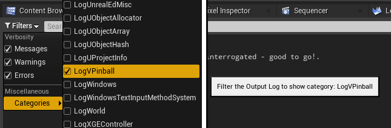
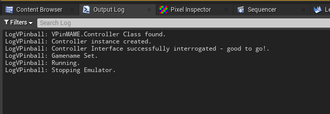

# Unreal-Visual-Pinball

## Branches
- **main** - main dev branch - should be good to pull and work with but may have issues.
- **dev** - development branch - more likely to be unstable, buggy, or fuggly.

## Current Status
Refactoring and reorganizing. Creating proper modules and getting things scoped properly.

Wanna play along?  Help is welcome - you can contact me on my 
[discord](https://discord.gg/TSKHvVFYxB) server.  I'm cptvideo up there.

## Project Origins  
Huge thanks go to [Datasung](https://github.com/datasung) from [bits4u.nl](https://www.bits4u.nl/unreal-engine-visual-pinball-part-1/).  He started the project 
as an Unreal C++ code project and allowed me to jump in, convert it to an Unreal Plugin, and start implementing some more features and
ideas.  We're both big fans pinball -- the art, the technology, the comradery -- and of all the work that's been done in the
visual/virtual pinball space.

---
# Documentation (sort of.  WIP)
## FAQ
Greetings and welcome!  First, a quick word of warning:  This is an in-development project -
it is not ready for play-testing and no playable games have been built with it...😉 yet.

### Is there a Sample Project to go along with this?  
No, not yet.  This is really just an early (pre-alpha) development project right now, so don't worry, you're 
not missing anything :-)  As soon as we have something that we can include here, we will.

### How is this thing supposed to work?
Blueprints.  The idea is that you set up "switch" events (button pushes, ball rollovers, etc.) that are passed to the ROM.  The ROM sends back "solenoid" events
that you implement to fire off things like flipper movements, kickers, slingshots, etc.

### WTF is a "ROM?"
The ROM is the firmware (program) burned into a chip on an IRL pinball machine.  It's the brains of 'modern' pinball
machines.  The ROM manages game modes and progression, scorekeeping, sounds, lights, solenoids, DMD display output, and all the
other rando-electro-mechanical-dohickeys that make pinball so wonderful.  The idea here is to provide a C++/Blueprint 
interface to the ROMs so we can build virtual pinball machines in Unreal.  In effect, this opens up a world of pinball
fun - not only running pinball machines as a game on a computer, but allowing us to design, modify, and build games that 
could be built as physical machines in the real world; taking input from physical buttons on a cabinet, and sending signals
to fire real world things like, lights, flippers, & solenoids attached to pop-bumpers, etc.

### Can I make my own ROMs?
Apparently so.  I haven't tried it yet, but there is [this toolkit](https://github.com/ScottKirvan/freewpc)
for generating ROM images.  If anyone is working with this and might be interested in building some simple test-fixture ROMs, 
please contact me. These would be roms that do things like simply firing solenoid and light events, DMD diagnostics, and 
processing input switches.

### Is there any more questions in your FAQ?
No, not yet :-)

## Prerequisites
- Unreal running in Windows - *I'm running 4.26 in Windows 10. Earlier versions may work.*
- VPinMAME installed and runnable - *quickstart: install [this](https://www.vpforums.org/index.php?app=downloads&showfile=11573)
  and note the location of VPinMAME within that install.*
- game ROMs installed in VPinMAME's ROMs folder - *We can't help you with this part... for reasons.*
- for developers:  compiler/dev env - *I'm using Visual Studio 2019.*

Unreal-Visual-Pinball uses COM object (COM component) communications to interface with VPinMAME's
DLL.  When VPinMAME is properly installed, it sets up registry keys that tell COM where to find the DLL.  If 
those keys aren't properly set up, the system will not run.

*"...those tiki-torches must be kept lit.... those seeds must be kept warm.... if those seeds die.... we die!"*

## Installation
This is kind of standard practice for GitHub Unreal plugins, but it goes kind of like this:
1. Create a new Unreal project.
1. Create a ```Plugins``` folder in your project directory.
1. Clone the GitHub repository into your ```Plugins``` folder.
1. Right-click on your Unreal project's ```.uproject``` file and select ```Generate Visual Studio Project Files```
1. Open your Visual Studio Solution file and compile your Unreal C++ project.

Please feel free to contribute an expansion of this explanation if you think it could help :-)

## Output Log
Plugin logging happens under the log category, ```LogVPinball```.  You can filter the 
output log to track plugin info and to get info that may help with plugin 
installation problems.

  



To utilize this category in your own C++ game or plugin code, 
include ```#include "<path>/E4_VPinMAME.h"``` 
and put ```DEFINE_LOG_CATEGORY(LogVPinball);``` at the top of your source file.  From
there you can use ```UE_LOG(LogVPinball, Log, TEXT("Test Log Message"));``` from within 
your own source code.  Change "Log" to whatever verbosity level you wish: 
(Fatal|Error|Warning|Display|Log|Verbose|VeryVerbose).

From Blueprints, you may use the ```<TBD>``` node to generate ```LogVPinball``` output.
